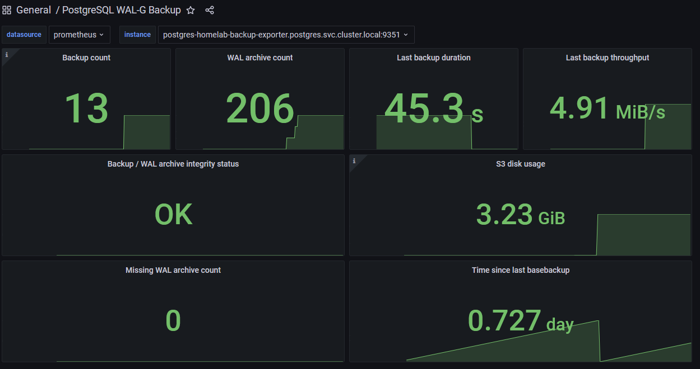

# wal-g-exporter
---

wal-g-exporter is a a Prometheus exporter for gathering WAL-G backup metrics for Postgres
databases. It plays nice with the [Zalando Spilo](https://github.com/zalando/spilo)
container especially and is configured by default to run within a Kubernetes environment
as a sidecar container of Spilo (see [Features and limitations](#features-and-limitations)).

## Features and limitations
---

As mentioned above, wal-g-exporter plays well along Spilo. This includes also Patroni
cluster configurations with Spilo. So wal-g-exporter is aware when running on a primary
instance or not. It will not collect and export metrics for standby / follower instances
and will get aware of a role change while running. This ensures, that you can always
collect metrics from all exporters in the Postgres cluster with no unwanted cumulation
of metrics between the exporters.

For a list of all exported metrics and a description on then see the [metrics](docs/metrics.md)
overview.

wal-g-exporter relies on having all needed WAL-G environment variables within an envdir under
`/run/etc/wal-e.d/env`. This is the default behavior of the Spilo image when you set the WAL-G
environment variables (e.g. `AWS_ACCESS_KEY_ID`, `AWS_ENDPOINT`...). The entrypoint of the image

## Configuration
---

The following environment variables can be used to configure wal-g-exporter.

| Variable name         | description                                                                    | default value |
| --------------------- | ------------------------------------------------------------------------------ | ------------- |
| HTTP_PORT             | Port on which the http process of wal-g-exporter will run on to expose metrics | `9351`        |
| PGHOST                | Hostname or IP of the Postgres instance to monitor metrics on                  | `localhost`   |
| PGPORT                | Port of the Postgres instance to monitor metrics on                            | `5432`        |
| PGUSER                | Username with which to connect to the Postgres instance                        | `postgres`    |
| PGDATABASE            | Database name of the Postgres instance to connect to                           | `postgres`    |
| PGPASSWORD            | Password of the above configured user                                          |               |
| PGSSLMODE             | SSL mode of the Postgres connection                                            | `require`     |
| WAL_G_SCRAPE_INTERVAL | Scrape interval of the exporter                                                | `60`          |

## Running as a sidecar with Spilo
---

Here you find an example sidecar configuration for wal-g-exporter to run along within a Spilo pod.
The most of the configuration is straightforward with one thing to mention. To make the envdir
`/run/etc/wal-e.d/env` shared between the Spilo container and wal-g-exporter, you need to mount
the volume `walg` (as here named in this example) also to the Spilo container. Spilo will take
care of the content in this directory.

```yaml
...
      - env:
        - name: POSTGRES_USER
          value: postgres
        - name: POSTGRES_PASSWORD
          valueFrom:
            secretKeyRef:
              key: password
              name: postgres.postgres-backup-exporter.credentials.postgresql.acid.zalan.do
        - name: PGHOST
          value: 127.0.0.1
        - name: PGPORT
          value: "5432"
        - name: PGPASSWORD
          valueFrom:
            secretKeyRef:
              key: password
              name: postgres.postgres-backup-exporter.credentials.postgresql.acid.zalan.do
        - name: PGUSER
          valueFrom:
            secretKeyRef:
              key: username
              name: postgres.postgres-backup-exporter.credentials.postgresql.acid.zalan.do
        image: ghcr.io/thedatabaseme/wal-g-prometheus-exporter:latest
        imagePullPolicy: IfNotPresent
        name: backup-exporter
        volumeMounts:
        - mountPath: /home/postgres/pgdata
          name: pgdata
        - mountPath: /run/etc
          name: walg
...
      volumes:
      - emptyDir:
          medium: Memory
        name: dshm
      - emptyDir: {}
        name: walg
...
```

An example log output of wal-g-exporter looks like this:

```
2023-05-06 10:12:49,413 - Is NOT in recovery mode? True
2023-05-06 10:12:49,413 - Connected to primary database
2023-05-06 10:12:49,413 - Evaluating wal-g backups...
2023-05-06 10:12:49,413 - Updating basebackup metrics...
2023-05-06 10:12:49,439 - 4 basebackups found (first: 2023-05-06T09:57:42.19257Z, last: 2023-05-06T10:10:01.951179Z)
2023-05-06 10:12:49,440 - Last basebackup duration: 1.3355910778045654
2023-05-06 10:12:49,440 - Finished updating basebackup metrics...
2023-05-06 10:12:49,440 - Updating WAL archive metrics...
2023-05-06 10:12:49,478 - WAL integrity status is: OK
2023-05-06 10:12:49,478 - Found 7 WAL archives in 1 timelines, 0 WAL archives missing
2023-05-06 10:12:49,479 - Finished updating WAL archive metrics...
2023-05-06 10:12:49,479 - Updating S3 disk usage...
2023-05-06 10:12:49,508 - S3 diskusage in bytes: 31420173
2023-05-06 10:12:49,508 - Finished updating S3 metrics...
2023-05-06 10:12:49,508 - All metrics collected. Waiting for next update cycle...
```

## Grafana dashboard
---

An example dashboard can be found under `grafana/dashboard.json`. Here is an example how it looks like:


# Disclaimer
---

This project has its roots in the [camptocamp/wal-g-prometheus-exporter](https://github.com/camptocamp/wal-g-prometheus-exporter)
project. I took both the idea and quite some amount of code from there. Since this project hasn't been
contributed in quite some time now and I had a different strategy on how to write code, I decided to
start over and take the code as a basis. So, many kudos to camptocamp.
